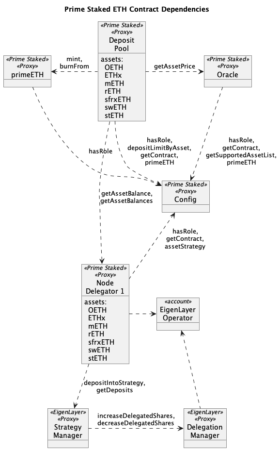
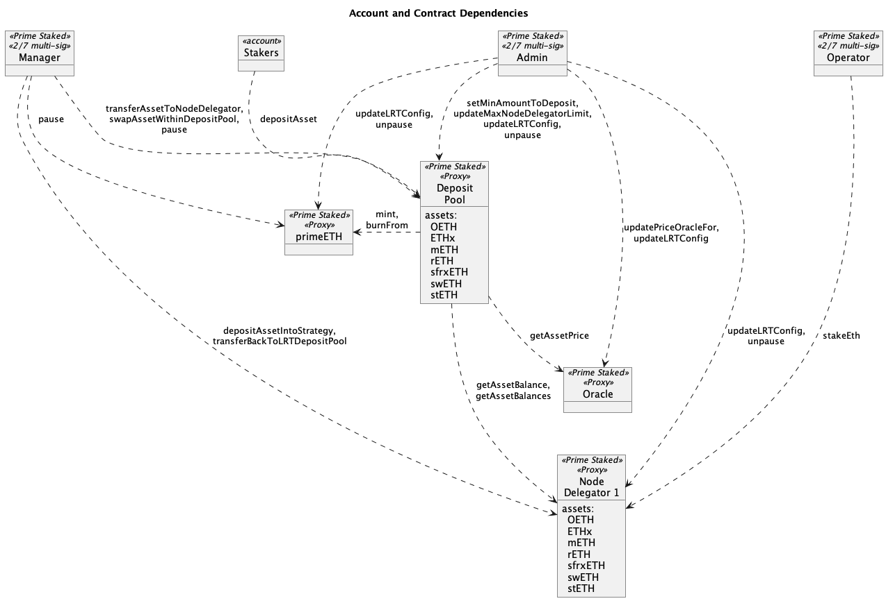
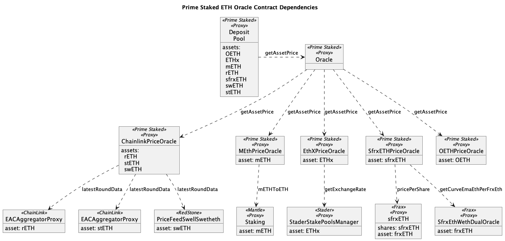
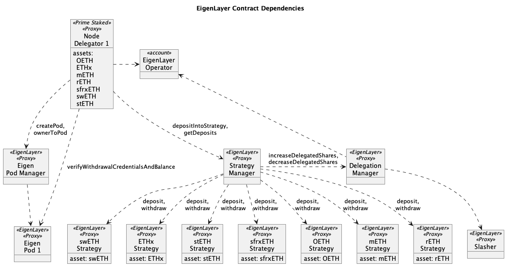

# Prime Staked ETH

[Prime Staked ETH](https://www.primestaked.com/) is liquid restaking built on top of
[EigenLayer](https://www.eigenlayer.xyz/).

# Contracts



## Mainnet Deployment

### Proxied contracts

| Contract Name                                                | Proxy Address                                                                                                              | Implementation Address                                                                                                     |
| ------------------------------------------------------------ | -------------------------------------------------------------------------------------------------------------------------- | -------------------------------------------------------------------------------------------------------------------------- |
| [PrimeStakedETH](./contracts/README.md#primestakedeth)       | [0x6ef3D766Dfe02Dc4bF04aAe9122EB9A0Ded25615](https://etherscan.io/address/0x6ef3D766Dfe02Dc4bF04aAe9122EB9A0Ded25615#code) | [0xd2fA8845c0998b327E25CcE94dbf8cafE8D234A2](https://etherscan.io/address/0xd2fA8845c0998b327E25CcE94dbf8cafE8D234A2#code) |
| [LRTDepositPool](./contracts/README.md#lrtdepositpool)       | [0xA479582c8b64533102F6F528774C536e354B8d32](https://etherscan.io/address/0xA479582c8b64533102F6F528774C536e354B8d32#code) | [0xC059Ce5a024f25Dc90f2f5C852b4dcc00f316262](https://etherscan.io/address/0xC059Ce5a024f25Dc90f2f5C852b4dcc00f316262#code) |
| [LRTConfig](./contracts/README.md#lrtconfig)                 | [0xF879c7859b6DE6FAdaFB74224Ff05b16871646bF](https://etherscan.io/address/0xF879c7859b6DE6FAdaFB74224Ff05b16871646bF#code) | [0xcdfD989e689872506E2897316b10e29c84AB087F](https://etherscan.io/address/0xcdfD989e689872506E2897316b10e29c84AB087F#code) |
| [LRTOracle](./contracts/README.md#lrtoracle)                 | [0xA755c18CD2376ee238daA5Ce88AcF17Ea74C1c32](https://etherscan.io/address/0xA755c18CD2376ee238daA5Ce88AcF17Ea74C1c32#code) | [0x76f6f696869Cc42c49A24acB4fbaB17E3B8fEE14](https://etherscan.io/address/0x76f6f696869Cc42c49A24acB4fbaB17E3B8fEE14#code) |
| [NodeDelegator](./contracts/README.md#nodedelegator) index 0 | [0x8bBBCB5F4D31a6db3201D40F478f30Dc4F704aE2](https://etherscan.io/address/0x8bBBCB5F4D31a6db3201D40F478f30Dc4F704aE2#code) | [0xAC49836f90E37B8Ab7db5de0e5Bec0b1621451F3](https://etherscan.io/address/0xAC49836f90E37B8Ab7db5de0e5Bec0b1621451F3#code) |
| [NodeDelegator](./contracts/README.md#nodedelegator) index 1 | [0x18169ee0ced9aa744f3cd01adc6e2eb2e8fb0087](https://etherscan.io/address/0x18169ee0ced9aa744f3cd01adc6e2eb2e8fb0087#code) | [0x7d18405358c52acb3d7c8d2226c1b2e0379c1efd](https://etherscan.io/address/0x7d18405358c52acb3d7c8d2226c1b2e0379c1efd#code) |

### Immutable Contracts

| Contract Name                                    | Address                                                                                                                    |
| ------------------------------------------------ | -------------------------------------------------------------------------------------------------------------------------- |
| [PrimeZapper](./contracts/utils/PrimeZapper.sol) | [0x3cf4Db4c59dCB082d1A9719C54dF3c04Db93C6b7](https://etherscan.io/address/0x3cf4Db4c59dCB082d1A9719C54dF3c04Db93C6b7#code) |

The following are [Open Zeppelin](https://www.openzeppelin.com/contracts) contracts.

| Contract Name | Address                                                                                                                    |
| ------------- | -------------------------------------------------------------------------------------------------------------------------- |
| ProxyFactory  | [0x279b272E8266D2fd87e64739A8ecD4A5c94F953D](https://etherscan.io/address/0x279b272E8266D2fd87e64739A8ecD4A5c94F953D#code) |
| ProxyAdmin    | [0xF83cacA1bC89e4C7f93bd17c193cD98fEcc6d758](https://etherscan.io/address/0xF83cacA1bC89e4C7f93bd17c193cD98fEcc6d758#code) |

### Operational Roles

The protocol is currently managed by a [Gnosis Safe](https://safe.global), 3 of 7 multi-signature wallet.

| Contract Name    | Address                                                                                                                    |
| ---------------- | -------------------------------------------------------------------------------------------------------------------------- |
| ProxyAdmin Owner | [0xEc574b7faCEE6932014EbfB1508538f6015DCBb0](https://etherscan.io/address/0xEc574b7faCEE6932014EbfB1508538f6015DCBb0#code) |
| Admin            | [0xEc574b7faCEE6932014EbfB1508538f6015DCBb0](https://etherscan.io/address/0xEc574b7faCEE6932014EbfB1508538f6015DCBb0#code) |
| Manager          | [0xEc574b7faCEE6932014EbfB1508538f6015DCBb0](https://etherscan.io/address/0xEc574b7faCEE6932014EbfB1508538f6015DCBb0#code) |
| Operator         | [0xEc574b7faCEE6932014EbfB1508538f6015DCBb0](https://etherscan.io/address/0xEc574b7faCEE6932014EbfB1508538f6015DCBb0#code) |



### Supported Liquid Staking Tokens (LSTs)

| Contract Name         | Address                                                                                                             |
| --------------------- | ------------------------------------------------------------------------------------------------------------------- |
| Origin (OETH)         | [0x856c4Efb76C1D1AE02e20CEB03A2A6a08b0b8dC3](https://etherscan.io/token/0x856c4Efb76C1D1AE02e20CEB03A2A6a08b0b8dC3) |
| Mantle (mETH)         | [0xd5f7838f5c461feff7fe49ea5ebaf7728bb0adfa](https://etherscan.io/token/0xd5f7838f5c461feff7fe49ea5ebaf7728bb0adfa) |
| Stader (ETHx)         | [0xA35b1B31Ce002FBF2058D22F30f95D405200A15b](https://etherscan.io/token/0xA35b1B31Ce002FBF2058D22F30f95D405200A15b) |
| Lido (stETH)          | [0xae7ab96520de3a18e5e111b5eaab095312d7fe84](https://etherscan.io/token/0xae7ab96520de3a18e5e111b5eaab095312d7fe84) |
| Staked Frax (sfrxETH) | [0xac3E018457B222d93114458476f3E3416Abbe38F](https://etherscan.io/token/0xac3E018457B222d93114458476f3E3416Abbe38F) |
| Rocket Pool (rETH)    | [0xae78736cd615f374d3085123a210448e74fc6393](https://etherscan.io/token/0xae78736cd615f374d3085123a210448e74fc6393) |
| Swell (swETH)         | [0xf951E335afb289353dc249e82926178EaC7DEd78](https://etherscan.io/token/0xf951E335afb289353dc249e82926178EaC7DEd78) |

### Oracle contracts



| Contract Name                                                        | Proxy Address                                                                                                              | Implementation Address                                                                                                     |
| -------------------------------------------------------------------- | -------------------------------------------------------------------------------------------------------------------------- | -------------------------------------------------------------------------------------------------------------------------- |
| [ChainlinkPriceOracle](./contracts/oracles/ChainlinkPriceOracle.sol) | [0xE238124CD0E1D15D1Ab08DB86dC33BDFa545bF09](https://etherscan.io/address/0xE238124CD0E1D15D1Ab08DB86dC33BDFa545bF09#code) | [0x84D4bA56A033abf1FEa28217cb86EC8A611B3E8E](https://etherscan.io/address/0x84D4bA56A033abf1FEa28217cb86EC8A611B3E8E#code) |
| [OETHPriceOracle](./contracts/oracles/OETHPriceOracle.sol)           | [0xc513bDfbC308bC999cccc852AF7C22aBDF44A995](https://etherscan.io/address/0xc513bDfbC308bC999cccc852AF7C22aBDF44A995#code) | [0xd91d3bEC19E921e911A487394B155da552953917](https://etherscan.io/address/0xd91d3bEC19E921e911A487394B155da552953917#code) |
| [WETHPriceOracle ](./contracts/oracles/WETHPriceOracle.sol)          | [0x2772337eD6cC93CB440e68607557CfCCC0E6b700](https://etherscan.io/address/0x2772337eD6cC93CB440e68607557CfCCC0E6b700#code) | [0xd480388103CC1F274e2e45C72C8D5B2F5188a47E](https://etherscan.io/address/0xd480388103CC1F274e2e45C72C8D5B2F5188a47E#code) |
| [SfrxETHPriceOracle](./contracts/oracles/SfrxETHPriceOracle.sol)     | [0x407d53b380A4A05f8dce5FBd775DF51D1DC0D294](https://etherscan.io/address/0x407d53b380A4A05f8dce5FBd775DF51D1DC0D294#code) | [0xE6BebE3072fF42a7c2A4A5a9864b30Bc5608d9C3](https://etherscan.io/address/0xE6BebE3072fF42a7c2A4A5a9864b30Bc5608d9C3#code) |
| [EthXPriceOracle](./contracts/oracles/EthXPriceOracle.sol)           | [0x85B4C05c9dC3350c220040BAa48BD0aD914ad00C](https://etherscan.io/address/0x85B4C05c9dC3350c220040BAa48BD0aD914ad00C#code) | [0xd101bd159968106595d48948677fee9e8a0450a9](https://etherscan.io/address/0xd101bd159968106595d48948677fee9e8a0450a9#code) |
| [MEthPriceOracle ](./contracts/oracles/MEthPriceOracle.sol)          | [0xE709cee865479Ae1CF88f2f643eF8D7e0be6e369](https://etherscan.io/address/0xE709cee865479Ae1CF88f2f643eF8D7e0be6e369#code) | [0x91Fad4007FF129ABFB72d0701C200f0957e9a0D8](https://etherscan.io/address/0x91Fad4007FF129ABFB72d0701C200f0957e9a0D8#code) |

| LST                   | Price Provider                                                                 | Price Source                                                                                                          |
| --------------------- | ------------------------------------------------------------------------------ | --------------------------------------------------------------------------------------------------------------------- |
| Origin (OETH)         | fixed 1 ETH                                                                    |                                                                                                                       |
| Mantle (mETH)         | `mETHToETH` on Mantle Staking                                                  | [0xe3cBd06D7dadB3F4e6557bAb7EdD924CD1489E8f](https://etherscan.io/address/0xe3cBd06D7dadB3F4e6557bAb7EdD924CD1489E8f) |
| Stader (ETHx)         | `getExchangeRate` on Stake Pools Manager                                       | [0xcf5EA1b38380f6aF39068375516Daf40Ed70D299](https://etherscan.io/address/0xcf5EA1b38380f6aF39068375516Daf40Ed70D299) |
| Lido (stETH)          | [ChainLink](https://data.chain.link/feeds/ethereum/mainnet/steth-eth)          | [0x86392dC19c0b719886221c78AB11eb8Cf5c52812](https://etherscan.io/address/0x86392dC19c0b719886221c78AB11eb8Cf5c52812) |
| Staked Frax (sfrxETH) | [Frax Dual Oracle](https://docs.frax.finance/frax-oracle/frax-oracle-overview) | [0x584902BCe4282003E420Cf5b7ae5063D6C1c182a](https://etherscan.io/address/0x584902BCe4282003E420Cf5b7ae5063D6C1c182a) |
| Rocket Pool (rETH)    | [ChainLink](https://data.chain.link/feeds/base/base/reth-eth)                  | [0xf397bF97280B488cA19ee3093E81C0a77F02e9a5](https://etherscan.io/address/0xE238124CD0E1D15D1Ab08DB86dC33BDFa545bF09) |
| Swell (swETH)         | [RedStone](https://app.redstone.finance/#/app/token/SWETH\ETH)                 | [0x061bB36F8b67bB922937C102092498dcF4619F86](https://etherscan.io/address/0x061bB36F8b67bB922937C102092498dcF4619F86) |

### EigenLayer contracts

[EigenLayer's mainnet contract addresses](https://github.com/Layr-Labs/eigenlayer-contracts?tab=readme-ov-file#current-mainnet-deployment)



# Developer Guide

## Setup

1. Install dependencies

```bash
npm install

forge install
```

2. copy .env.example to .env and fill in the values

```bash
cp .env.example .env
```

## Usage

This is a list of the most frequently needed commands.

### Clean

Delete the build artifacts and cache directories:

```sh
forge clean
```

### Compile

Compile the contracts:

```bash
forge build
```

### Format

Format the contracts:

```bash
forge fmt
```

### Lint

Lint the contracts:

```bash
$ npm lint
```

## Testing

### Unit Tests

```sh
make unit-test
```

### Fork Tests

Run the fork tests against mainnet or a local. The `FORK_RPC_URL` env var controls whether the fork tests run against
mainnet or a local forked node.

```bash
make fork-test
```

### Integration Tests

Run the integration tests against Goerli

```bash
make int-test
```

### Test Coverage

Generate test coverage and output result to the terminal:

```sh
$ npm test:coverage
```

Generate test coverage with lcov report (you'll have to open the `./coverage/index.html` file in your browser, to do so
simply copy paste the path):

```sh
$ npm test:coverage:report
```

### Gas Usage

Get a gas report:

```bash
$ forge test --gas-report
```

## Deploy

### Test Goerli deployment against a local Anvil fork of Goerli

The runs the Goerli deployment in a fork and does not broadcast the transactions to the local Anvil node. The contracts
will NOT be deployed to the local Anvil node.

Set `GOERLI_DEPLOYER_PRIVATE_KEY` and `FORK_RPC_URL` environment variables in the `.env` file.

In one terminal run

```bash
make node-test-fork
```

In another terminal run

```bash
make deploy-testnet-fork
```

### Deploy to Goerli testnet

Set `GOERLI_DEPLOYER_PRIVATE_KEY`, `GOERLI_RPC_URL` and `GOERLI_ETHERSCAN_API_KEY` environment variables in the `.env`
file.

```bash
make deploy-testnet
```

Update the address in [Addresses.sol](./contracts/utils/Addresses.sol) if this new deployment is going to be used for
more Goerli testing.

### For tests (mainnet) using Anvil:

In one terminal run the Anvil node forking the mainnet

```bash
make node-fork
```

In another terminal apply the deploys that are not yet on mainnet.

```bash
make pool-deleg-oracle-fork
make add-assets-fork
```

### Deploy to Anvil:

```bash
make deploy-lrt-local-test
```

### General Mainnet Deploy Script Instructions

Create a new ordered deploy script in `script/foundry-scripts/mainnet`. For example, `10_deployNativeETH.s.sol`

To run the script as a dry-run against a local forked node, start an Anvil node in one terminal:

```bash
make node-fork
```

And run the following in a new terminal:

```bash
IS_FORK=true forge script script/foundry-scripts/mainnet/10_deployNativeETH.s.sol:DeployNativeETH --rpc-url localhost --broadcast -vvv
```

To run the script against mainnet, set `DEPLOYER_PRIVATE_KEY` in your `.env` file and following command:

```bash
forge script script/foundry-scripts/mainnet/10_deployNativeETH.s.sol:DeployNativeETH --rpc-url ${MAINNET_RPC_URL}  --broadcast --etherscan-api-key ${ETHERSCAN_API_KEY} --verify -vvv
```

For instructions on how to deploy to a testnet or mainnet, check out the
[Solidity Scripting](https://book.getfoundry.sh/tutorials/solidity-scripting.html) tutorial.

### Verify Contracts

Follow this pattern `contractAddress=<contractAddress> contractPath=<contract-path> make verify-contract-testnet`

Example:

```bash
contractAddress=0x0000000000000000000000000000000000000000 contractPath=contracts/LRTConfig.sol:LRTConfig  make verify-contract-testnet
```

## Open Zeppelin Defender

[Open Zeppelin Defender v2](https://docs.openzeppelin.com/defender/v2/) is used to manage the Operations account and
automate AMM operational jobs like updating the primeETH exchange rate.

### Generate Relayer API key

The `Prime Staked` operator account is a [Defender v2 Relayer](https://defender.openzeppelin.com/v2/#/manage/relayers)
account with address
[0x5De069482Ac1DB318082477B7B87D59dfB313f91](https://etherscan.io/address/0x5De069482Ac1DB318082477B7B87D59dfB313f91).

To create an API key for the Relayer account go to the `Manage` tab on the top right of the Defender UI.

Click `Relayers` on the left menu and select the
[Prime Staked](https://defender.openzeppelin.com/v2/#/manage/relayers?relayerId=970f29e6-7063-4732-95c8-f80ccf8975e2)
Relayer.

Click the `Create new API Key` to get the new API key and secret.

Add the API key and secret to the `.env` file.

```bash
# Open Zeppelin Defender Relayer account API key
DEFENDER_RELAYER_KEY=
DEFENDER_RELAYER_SECRET=
```

> :warning: Remember to delete the API key when you are done using it.

### Deploying Defender Actions

Actions are used to run operational jobs are specific times or intervals.

[rollup](https://rollupjs.org/) is used to bundle Actions source code in
[/script/defender-actions](./script/defender-actions) into a single file that can be uploaded to Defender. The
implementation was based off
[Defender Actions example using Rollup](https://github.com/OpenZeppelin/defender-autotask-examples/tree/master/rollup).
The rollup config is in [/script/defender-actions/rollup.config.cjs](./script/defender-actions/rollup.config.cjs). The
outputs are written to task specific folders under [/script/defender-actions/dist](./script/defender-actions/dist/).

The [defender-autotask CLI](https://www.npmjs.com/package/@openzeppelin/defender-autotask-client) is used to upload the
Action code to Defender. For this to work, a Defender Team API key with `Manage Actions` capabilities is needed. This
can be generated by a Defender team admin under the `Manage` tab on the top right of the UI and then `API Keys` on the
left menu. Best to unselect all capabilities except `Manage Actions`.

Save the Defender Team API key and secret to your `.env` file.

```
# Open Zeppelin Defender Team API key
DEFENDER_TEAM_KEY=
DEFENDER_TEAM_SECRET=
```

The following will bundle the Actions code ready for upload.

```
cd ./script/defender-actions

npx rollup -c
```

The following will upload the different Action bundles to Defender.

```sh
# change to the defender-actions folder
cd ./script/defender-actions
npx rollup -c

# Export the DEFENDER_TEAM_KEY and DEFENDER_TEAM_SECRET environment variables
export DEFENDER_TEAM_KEY=
export DEFENDER_TEAM_SECRET=
# Alternatively, the following can be used but it will export all env var including DEPLOYER_PRIVATE_KEY
# set -o allexport && source ../../.env && set +o allexport

# Set the DEBUG environment variable to prime* for the Defender Action
npx hardhat setActionVars --id 184e6533-9413-48be-ac01-4a63f87c3035
npx hardhat setActionVars --id 7dda695d-56b1-48ba-9e9a-3307c4a2f7bb
npx hardhat setActionVars --id 0cfd91ac-1248-4470-ba1f-e58cd8514b3d
npx hardhat setActionVars --id d990c176-897d-4739-8f20-563fbacf11b0

# Upload Deposit to EigenLayer code
# The Defender autotask client uses generic env var names so we'll set them first from the values in the .env file
export API_KEY=${DEFENDER_TEAM_KEY}
export API_SECRET=${DEFENDER_TEAM_SECRET}
# Goerli
npx defender-autotask update-code 7dda695d-56b1-48ba-9e9a-3307c4a2f7bb ./dist/operateValidators
# Mainnet
npx defender-autotask update-code 184e6533-9413-48be-ac01-4a63f87c3035 ./dist/depositAllEL
npx defender-autotask update-code d990c176-897d-4739-8f20-563fbacf11b0 ./dist/transferWETH
npx defender-autotask update-code 0cfd91ac-1248-4470-ba1f-e58cd8514b3d ./dist/operateValidators
```

`rollup` and `defender-autotask-client` can be installed globally to avoid the `npx` prefix.

### Mainnet Defender Actions

| Name                                                  | ID                                                                                                                                    | Source Code                                                                                     |
| ----------------------------------------------------- | ------------------------------------------------------------------------------------------------------------------------------------- | ----------------------------------------------------------------------------------------------- |
| Prime - Deposit LSTs to EigenLayer                    | [184e6533-9413-48be-ac01-4a63f87c3035](https://defender.openzeppelin.com/v2/#/actions/automatic/184e6533-9413-48be-ac01-4a63f87c3035) | [/script/defender-actions/depositAllEL.js](./script/defender-actions/depositAllEL.js)           |
| Prime - transfer WETH to Native Staking NodeDelegator | [d990c176-897d-4739-8f20-563fbacf11b0](https://defender.openzeppelin.com/v2/#/actions/automatic/d990c176-897d-4739-8f20-563fbacf11b0) | [/script/defender-actions/transferWETH.js](./script/defender-actions/transferWETH.js)           |
| Prime - primeETH Price Updater                        | [e5ab3a21-ed4d-4b0a-b07a-c3127a59895c](https://defender.openzeppelin.com/v2/#/actions/automatic/e5ab3a21-ed4d-4b0a-b07a-c3127a59895c) |                                                                                                 |
| Prime - Add validator                                 | [0cfd91ac-1248-4470-ba1f-e58cd8514b3d](https://defender.openzeppelin.com/v2/#/actions/automatic/0cfd91ac-1248-4470-ba1f-e58cd8514b3d) | [/script/defender-actions/operateValidators.js](./script/defender-actions/operateValidators.js) |

### Goerli Defender Actions

| Name                           | ID                                                                                                                                    | Source Code                                                                                     |
| ------------------------------ | ------------------------------------------------------------------------------------------------------------------------------------- | ----------------------------------------------------------------------------------------------- |
| Prime - Add validator - Goerli | [7dda695d-56b1-48ba-9e9a-3307c4a2f7bb](https://defender.openzeppelin.com/v2/#/actions/automatic/7dda695d-56b1-48ba-9e9a-3307c4a2f7bb) | [/script/defender-actions/operateValidators.js](./script/defender-actions/operateValidators.js) |

## Goerli Testing

After the Goerli contracts have been deployed and addresses updated in `Addresses.sol` and `addresses.js`. This includes
the EigenPod for the new native staking NodeDelegator.

Make sure the `GOERLI_RPC_URL` environment variable is set in the `.env` file.

Generate an API key for the Goerli Defender Relayer and set the `DEFENDER_RELAYER_KEY` and `DEFENDER_RELAYER_SECRET`
environment variables in the `.env` file.

```
export DEBUG=prime*
npx hardhat depositWETH --amount 32 --network goerli
npx hardhat depositPrime --symbol WETH --amount 32 --network goerli
npx hardhat depositEL --symbol WETH --index 1  --network goerli
npx hardhat operateValidators --network goerli
```

# Validators

This section contains the required steps and dependencies to create validator keys and splitting them.

First download the "staking-deposit-cli" tool from the
[ethereum release page](https://github.com/ethereum/staking-deposit-cli/releases) that is a CLI tool for generating
keystore files. Extract the file and move it somewhere on the $PATH (e.g. /usr/local/bin)

Create a new mnemonic in offline mode:

```bash
deposit new-mnemonic
```

Follow the wizard and create a required number of validator keys - the wizard ask what number of keys are required -
along with the validator deposit data. Example validator keys for mnemonic "daughter topple square amount rich elder
regret blade crisp auto burden shoe enrich weasel apart case space zebra require oyster stadium icon truly result" are
located in `validator_key_data/validator_keys`

After that create shares data that can be used by the DVT to deploy distributed validators. See example command:

```bash
npx hardhat splitValidatorKey --network goerli --operatorids 60.79.220.349 --operatorkeys LS0tLS1CRUdJTiBSU0EgUFVCTElDIEtFWS0tLS0tCk1JSUJJakFOQmdrcWhraUc5dzBCQVFFRkFBT0NBUThBTUlJQkNnS0NBUUVBMHZPbHNpTzVCV0dDTEM1TUxDQW8KYkN0ZDI5NmNvaFN0MGhhMmtpRjMwNi9NR2Y5OVRORCs0TmpRWXNEQVlFYVJjZFhNUjY1bjdHTk4yUkkxdTg0aQpTZm04NElKTTdIRGsxeUpVTGdGcnRmQ00yWG03ZzFYODZ3ZkZGT2JrWUJSQmNIZnZSZUxHcDdzdjFpSFh1M2s3CkszVzJvUnZhV2U4V3k3MGdXS25jeWROakZpWDJIQ2psQnIyRjhJT0Z0SHI3cGpyWnZqa0ROcDFkMnprK2V6YncKdCticUMySnFSaVF4MGI5d0d4d3h0UERERjY0amVtWDRpMkJPWXNvUkx6dkN6dWtaeHB3UlNJOW1wTHE1UktOaApIY1pEcWg3RUV5VFloUG1BTTcvT2luMWROZCtNUi9VRU5mTkJqMGZMVURhZWJWSUVVMEhzRzMzdHV3MmR5RksxCnRRSURBUUFCCi0tLS0tRU5EIFJTQSBQVUJMSUMgS0VZLS0tLS0K.LS0tLS1CRUdJTiBSU0EgUFVCTElDIEtFWS0tLS0tCk1JSUJJakFOQmdrcWhraUc5dzBCQVFFRkFBT0NBUThBTUlJQkNnS0NBUUVBbzRtb2hUcVdKRGhyYkp5MlhXeXUKQjZIOFU3OXpxS2VhdGdweGRIcS9iWkxrTHpNcE10SVNNOEd3ckUxVlhmMUZ1RWhqcXhTQko0V1hnb0RxWGZTNQp4Q0RIeUdwSld1STF5Q3V5Z3NLRE96QkU4OWZaZEZlY1BsQTZpbzYxR0ROWkJPOWNEOGY2VnFiblN1TDRIMEZjCnkwdk5SdmdROWhEUFJZcHhMVER6N1gyU1RYZWk5eGcyVVdBYm01QUZVbm9WR01yZ2R4YkY5ZjlaNDZDZVk0TFgKL3pqQW1DNFl5YVlYZk9TL2lzQkZkYTN3RlFZZmVhcVVWb2huOCt6ZFg3Y2p4SVZrdDVtQ2FqVFo2bXJzWEFBNApzTDQxaEM4Z0NKYmdESDhIcEZaVXViYUFFUEswV1dZOENCUEhMY1dtWWxLeEJhVEdaU25SM2ZBN3hRcU5lK3VvCkl3SURBUUFCCi0tLS0tRU5EIFJTQSBQVUJMSUMgS0VZLS0tLS0K.LS0tLS1CRUdJTiBSU0EgUFVCTElDIEtFWS0tLS0tCk1JSUJJakFOQmdrcWhraUc5dzBCQVFFRkFBT0NBUThBTUlJQkNnS0NBUUVBeUtiUGc2SXRnTGJSTHpHK0VhMUcKSGdSQm45a3J2N2pXN09ocGxqQWg3MUtCVnFNVldtZi9LRVlBUis1Qnp2bGdwV3ptc3pxZ3MyeDN6UzB5MHd0Zgp6WkVLZ2NrMDJIcXVTMzIwTUJ2QTBLN3B0OFc4Qm9ZM3ozS3d4bUpwUnNwZ3p5dm80TGIyU3RsL1FBNFE4cjZsCjVOWjdrRVNHVktFTFA3R3JrQTlYajBOS0wxZU5uYTRocnpEcnpJS1FwMGZkcjBpWWFxRnhNWUZBZ0FUcVp2b1kKbGxDWG16TmdaUDdtaERRWTdWSk9kenJkSTBrOEdISTZpWUFlWUExRVR1Y01mckpzMmd0a0FPRlR6TjhYYW5VWgpkQis1c0g2V0UwSGhvVGFCeGYwcHpnTFpvenROdTdpUzFmRlZOTUNnR3BCc3MxMDcxMEZFNE1aYW1uWFMxeWt5ClN3SURBUUFCCi0tLS0tRU5EIFJTQSBQVUJMSUMgS0VZLS0tLS0K.LS0tLS1CRUdJTiBSU0EgUFVCTElDIEtFWS0tLS0tCk1JSUJJakFOQmdrcWhraUc5dzBCQVFFRkFBT0NBUThBTUlJQkNnS0NBUUVBd1l0MEdGdmRORTA3L1NuNGdSSnUKNkhlWHU0S3RkL1k1ZGkweGFFNUNyYXZyenU3ZXNIZzg0SXRmcURVbTQrVTNJQm9LelFkdUNKdkw5L1FwTG5LaApTanRzcEpid0gxd2liYXppcVFuM08zbVljb0tYWjAvWDVJamoyUG9hVG13cUkrTFlLbUNXNWFQR3psWklpYUF2ClNGQ2V6M3BFTllQOFNlMFRObm1UaWNuMGRkVkIwMU9uRzJxZEZIMXhBRGNxckFwTE52NmVhMzF6eUdRTG9FbHoKTzFMK2VjZzB3SHRON0hqYnZGUDczcDF5TTA4UU1LRzV6ellKUTVJWmEwL3lWK213blJpSjZTcTZEUkgxd1JwYQpHeXpYQWNqYTBJSER0ckJPdCtOQ2grZS8vVU1Gd3B3OS8zMG5rN2JBRVBOcDY3Qks3Q0tnU0FHLzhxcmt4bHRVCi93SURBUUFCCi0tLS0tRU5EIFJTQSBQVUJMSUMgS0VZLS0tLS0K --keystorelocation validator_key_data/validator_keys/keystore-m_12381_3600_1_0_0-1708952408.json --keystorepass testtest
```

# Credits

This repo was originally forked from [Kelp DAO](https://github.com/kelp-DAO/KelpDAO-contracts/). It's been further
developed by [Origin Protocol](https://www.originprotocol.com/) since January 2024.
