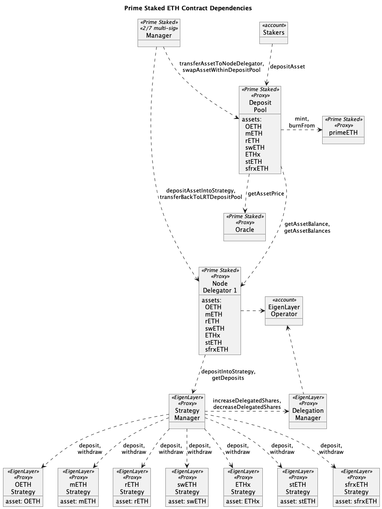

# Prime Staked Eth

## Setup

1. Install dependencies

```bash
npm install

forge install
```

2. copy .env.example to .env and fill in the values

```bash
cp .env.example .env
```

## Usage

This is a list of the most frequently needed commands.

### Clean

Delete the build artifacts and cache directories:

```sh
$ forge clean
```

### Compile

Compile the contracts:

```sh
$ forge build
```

### Coverage

Get a test coverage report:

```sh
$ forge coverage
```

### Deploy

## Deploy to testnet

```bash
make deploy-lrt-testnet
```

## For tests (mainnet) using Anvil:

In one terminal run the Anvil node forking the mainnet
```bash
make node-fork
```

In another terminal apply the deploys that are not yet on mainnet.
```bash
make pool-deleg-oracle-fork
make add-assets-fork
```

Run the unit tests
```bash
make unit-test
```

Run the integration tests against Goerli
```bash
make int-test
```

Run the fork tests against mainnet or a local.
The `FORK_RPC_URL` env var controls whether the fork tests run against mainnet or a local forked node.
```bash
make fork-test
```

## Deploy to Anvil:

```bash
make deploy-lrt-local-test
```

### General Deploy Script Instructions

Create a Deploy script in `script/Deploy.s.sol`:

and run the script:

```sh
$ forge script script/Deploy.s.sol --broadcast --fork-url http://localhost:8545
```

For instructions on how to deploy to a testnet or mainnet, check out the
[Solidity Scripting](https://book.getfoundry.sh/tutorials/solidity-scripting.html) tutorial.


## Verify Contracts

Follow this pattern
`contractAddress=<contractAddress> contractPath=<contract-path> make verify-lrt-proxy-testnet`

Example:
```bash
contractAddress=0x0000000000000000000000000000000000000000 contractPath=contracts/LRTConfig.sol:LRTConfig  make verify-lrt-proxy-testnet
```


### Format

Format the contracts:

```sh
$ forge fmt
```

### Gas Usage

Get a gas report:

```sh
$ forge test --gas-report
```

### Lint

Lint the contracts:

```sh
$ npm lint
```

### Test

Run the tests:

```sh
$ forge test
```

Run just the unit tests

```sh
$ forge test --no-match-contract "(Skip|IntegrationTest)"
```

Generate test coverage and output result to the terminal:

```sh
$ npm test:coverage
```

Generate test coverage with lcov report (you'll have to open the `./coverage/index.html` file in your browser, to do so
simply copy paste the path):

```sh
$ npm test:coverage:report
```

### Credits

Originally forked from Kelp. Further development by Origin Protocol beginning January 2024.

# Deployed Contracts



## Mainnet

### Proxied contracts

| Contract Name           | Proxy Address                                  | Implementation Address                         |
|-------------------------|------------------------------------------------|------------------------------------------------|
| PrimeStakedETH          | 0x6ef3D766Dfe02Dc4bF04aAe9122EB9A0Ded25615     | 0xd2fA8845c0998b327E25CcE94dbf8cafE8D234A2     |
| LRTDepositPool          | 0xA479582c8b64533102F6F528774C536e354B8d32     | 0x51ADD57dC33A3CB5FFf28Fe149198BD38753975D     |
| LRTConfig               | 0xF879c7859b6DE6FAdaFB74224Ff05b16871646bF     | 0xcdfD989e689872506E2897316b10e29c84AB087F     |
| LRTOracle               | 0xA755c18CD2376ee238daA5Ce88AcF17Ea74C1c32     | 0xeF8c39489A83467B1c994B8E4c62cBE26DEB69ce     |
| ChainlinkPriceOracle    | 0xE238124CD0E1D15D1Ab08DB86dC33BDFa545bF09     | 0x255C082Fb505212BA2396EDbF621d8aF1e5D29A5     |
| OethPriceOracle         | 0xc513bDfbC308bC999cccc852AF7C22aBDF44A995     | 0xd91d3bEC19E921e911A487394B155da552953917     |
| SfrxETHPriceOracle      | 0x407d53b380A4A05f8dce5FBd775DF51D1DC0D294     | 0xE6BebE3072fF42a7c2A4A5a9864b30Bc5608d9C3     |
| EthXPriceOracle         | 0x85B4C05c9dC3350c220040BAa48BD0aD914ad00C     | 0xd101bd159968106595d48948677fee9e8a0450a9     |
| MEthPriceOracle         | 0xE709cee865479Ae1CF88f2f643eF8D7e0be6e369     | 0x91Fad4007FF129ABFB72d0701C200f0957e9a0D8     |
| NodeDelegator index 0   | 0x8bBBCB5F4D31a6db3201D40F478f30Dc4F704aE2     | 0xEBd48593C5463efa51a9971ce6bdB8A8761F0676     |
| NodeDelegator index 1   | 0x0000000000000000000000000000000000000000     | 0x0000000000000000000000000000000000000000     |

### Immutable Contracts

| Contract Name           |  Address                                       |
|-------------------------|------------------------------------------------|
| ProxyFactory            | 0x279b272E8266D2fd87e64739A8ecD4A5c94F953D     |
| ProxyAdmin              | 0xF83cacA1bC89e4C7f93bd17c193cD98fEcc6d758     |

### Operational Roles

| Contract Name     |  Address                                       |
|-------------------|------------------------------------------------|
| ProxyAdmin Owner  | 0xEc574b7faCEE6932014EbfB1508538f6015DCBb0     |
| Admin             | 0xEc574b7faCEE6932014EbfB1508538f6015DCBb0     |
| Manager           | 0xEc574b7faCEE6932014EbfB1508538f6015DCBb0     |
| Operator          | 0xEc574b7faCEE6932014EbfB1508538f6015DCBb0     |
