# Prime Staked ETH Contracts

## PrimeStakedETH

[PrimeStakedETH.sol](./PrimeStakedETH.sol)

### Hierarchy

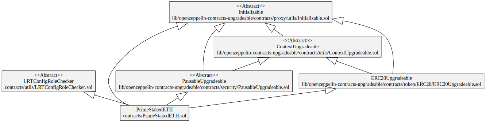

### Squashed

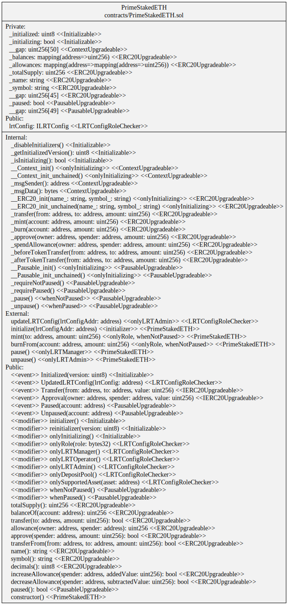

### Storage

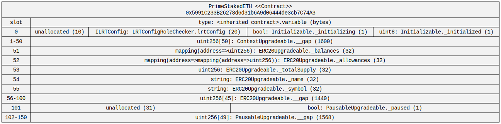

## LRTDepositPool

[LRTDepositPool.sol](./LRTDepositPool.sol)

### Hierarchy

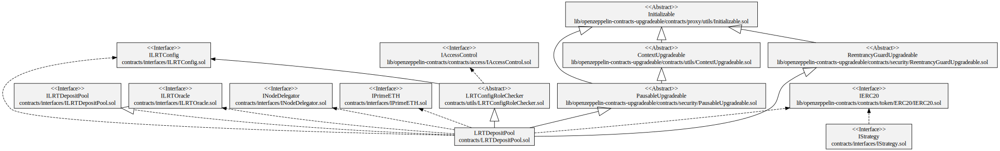

### Squashed

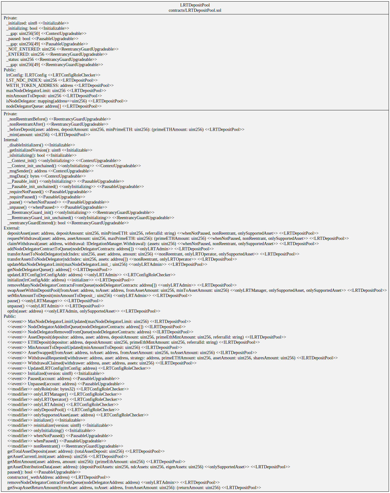

### Storage

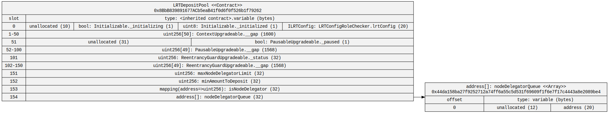

## LRTOracle

[LRTOracle.sol](./LRTOracle.sol)

### Hierarchy

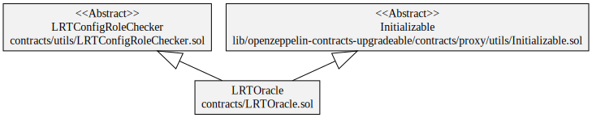

### Squashed

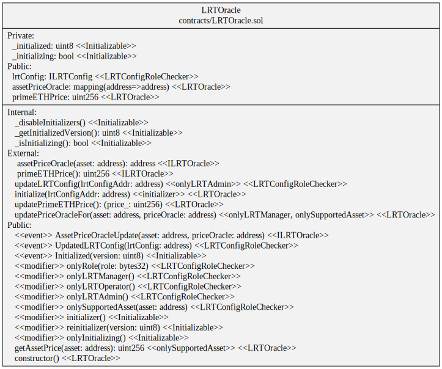

### Storage

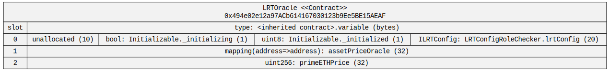

## NodeDelegator

[NodeDelegator.sol](./NodeDelegator.sol)

### Hierarchy

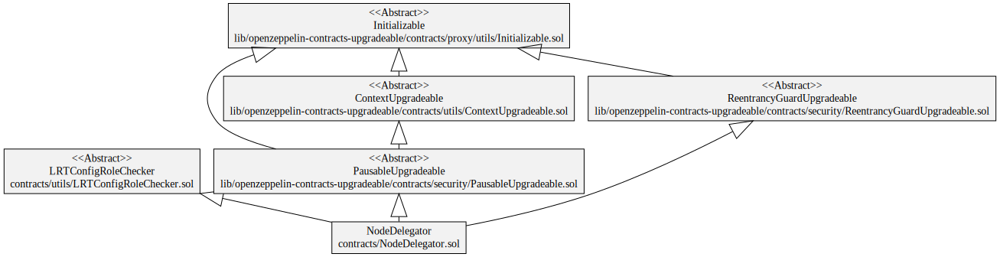

### Squashed

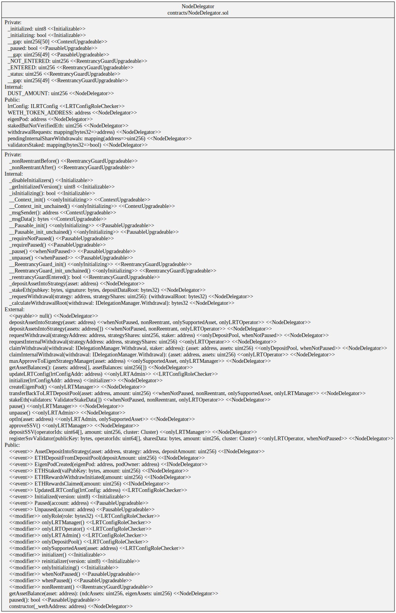

### Storage

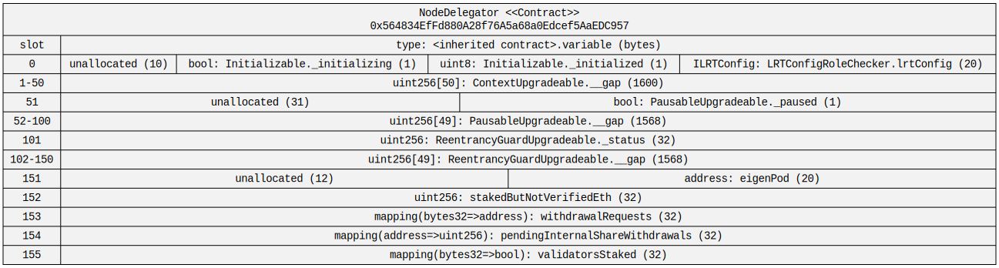

## LRTConfig

[LRTConfig.sol](./LRTConfig.sol)

### Hierarchy

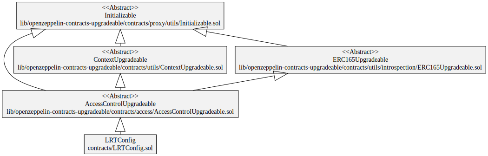

### Squashed

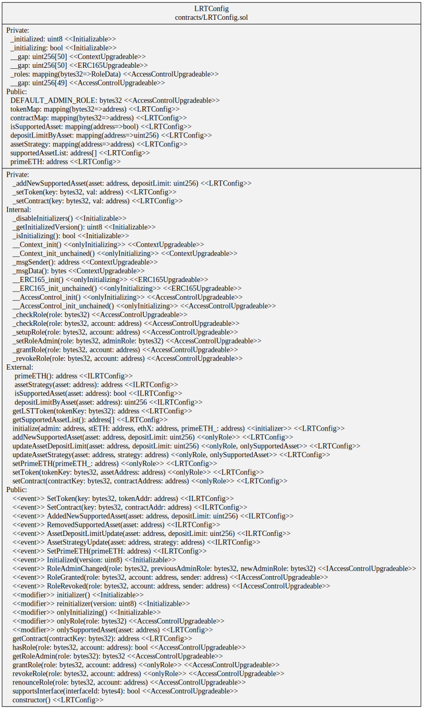

### Storage

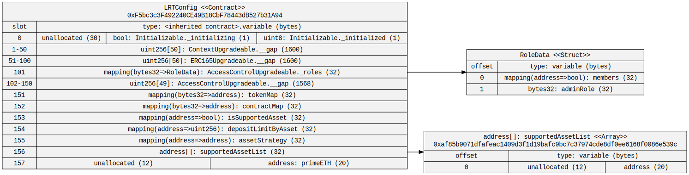

## PrimeZapper

[PrimeZapper.sol](./utils/PrimeZapper.sol)

### Squashed

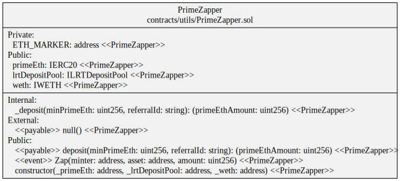
