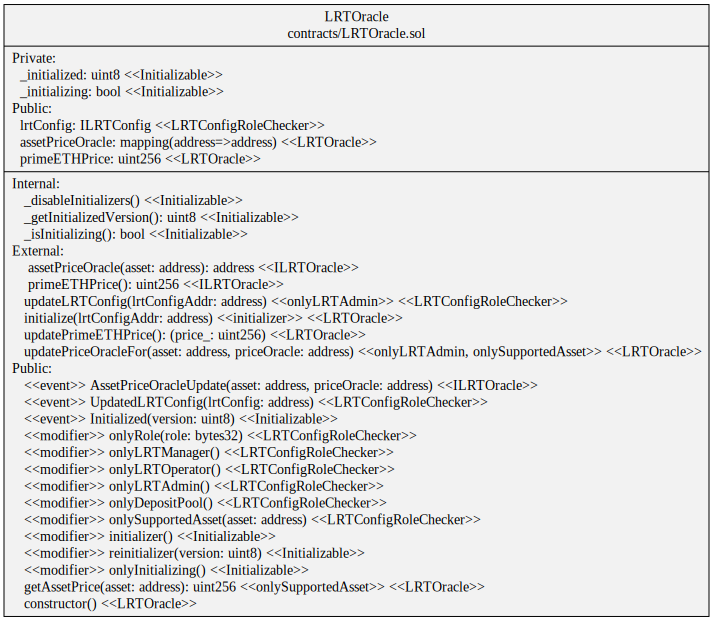
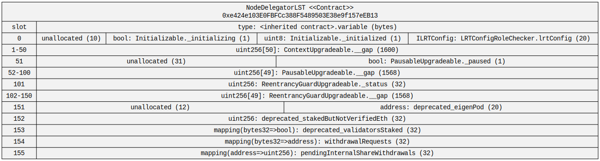
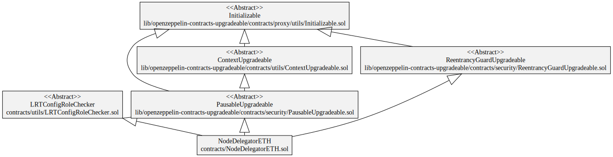
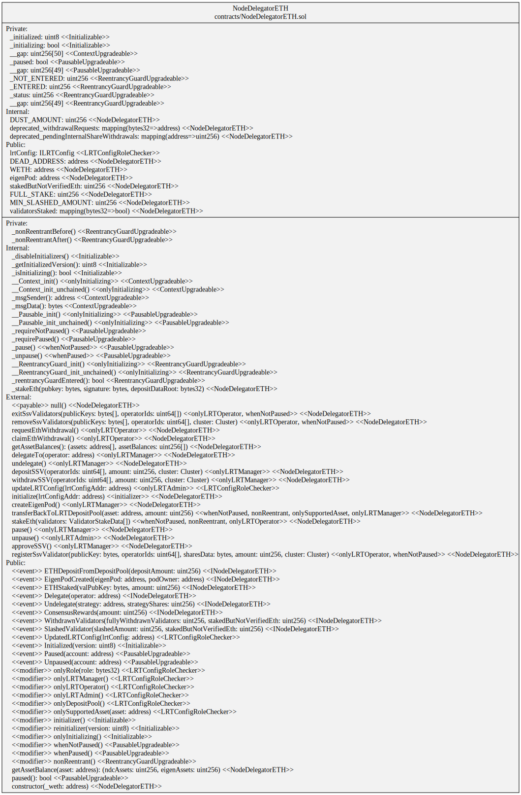
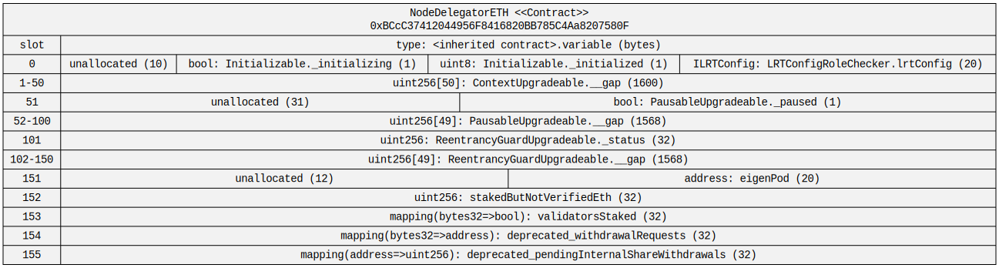

# Prime Staked ETH Contracts

## PrimeStakedETH

[PrimeStakedETH.sol](./PrimeStakedETH.sol)

### Hierarchy

### Squashed

### Storage

## LRTDepositPool

[LRTDepositPool.sol](./LRTDepositPool.sol)

### Hierarchy

### Squashed

### Storage

## LRTOracle

[LRTOracle.sol](./LRTOracle.sol)

### Hierarchy

### Squashed

### Storage

## NodeDelegatorLST

[NodeDelegatorLST.sol](./NodeDelegatorLST.sol)

### Hierarchy

### Squashed

### Storage

## NodeDelegatorETH

[NodeDelegatorETH.sol](./NodeDelegatorETH.sol)

### Hierarchy

### Squashed

### Storage

## LRTConfig

[LRTConfig.sol](./LRTConfig.sol)

### Hierarchy

### Squashed

### Storage

## PrimeZapper

[PrimeZapper.sol](./utils/PrimeZapper.sol)

### Squashed

