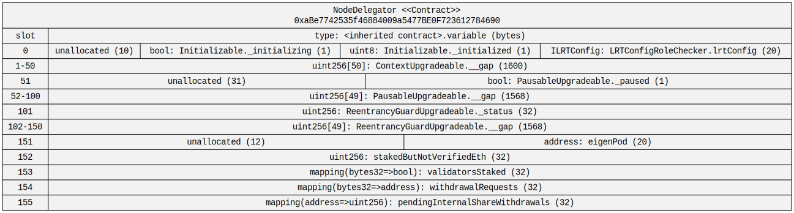

# Prime Staked ETH Contracts

## PrimeStakedETH

### Hierarchy

### Squashed

### Storage

## LRTDepositPool

### Hierarchy

### Squashed

### Storage

## LRTOracle

### Hierarchy

### Squashed

### Storage

## NodeDelegator

### Hierarchy

### Squashed

### Storage

## LRTConfig

### Hierarchy

### Squashed

### Storage

