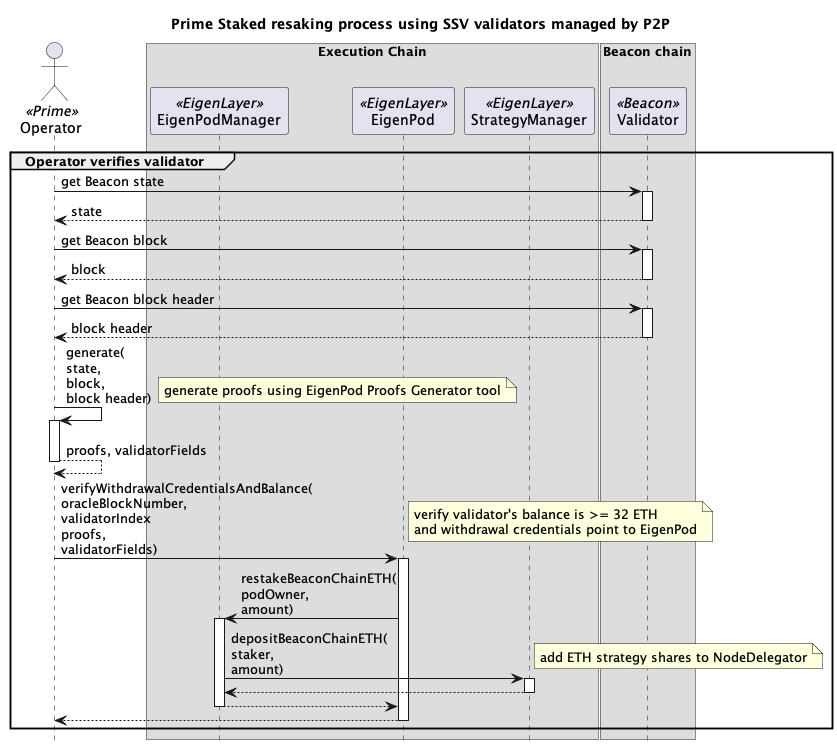
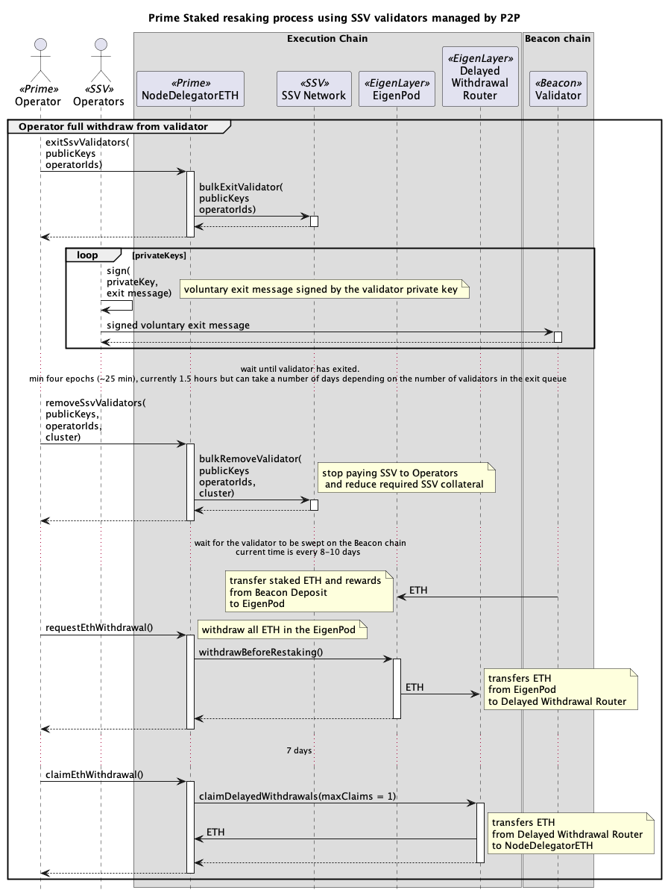

# Native ETH Restaking Processes

## Manager setup of EigenPod and SSV Network

## Operator creates a new SSV validator

## User deposits WETH into Prime Staked

## Operator Stakes 32 ETH to new validator

## Manager deposits more SSV to SSV cluster

## Operator verifies validator

## Operator withdraws consensus rewards

## Operator full withdraw from validator

