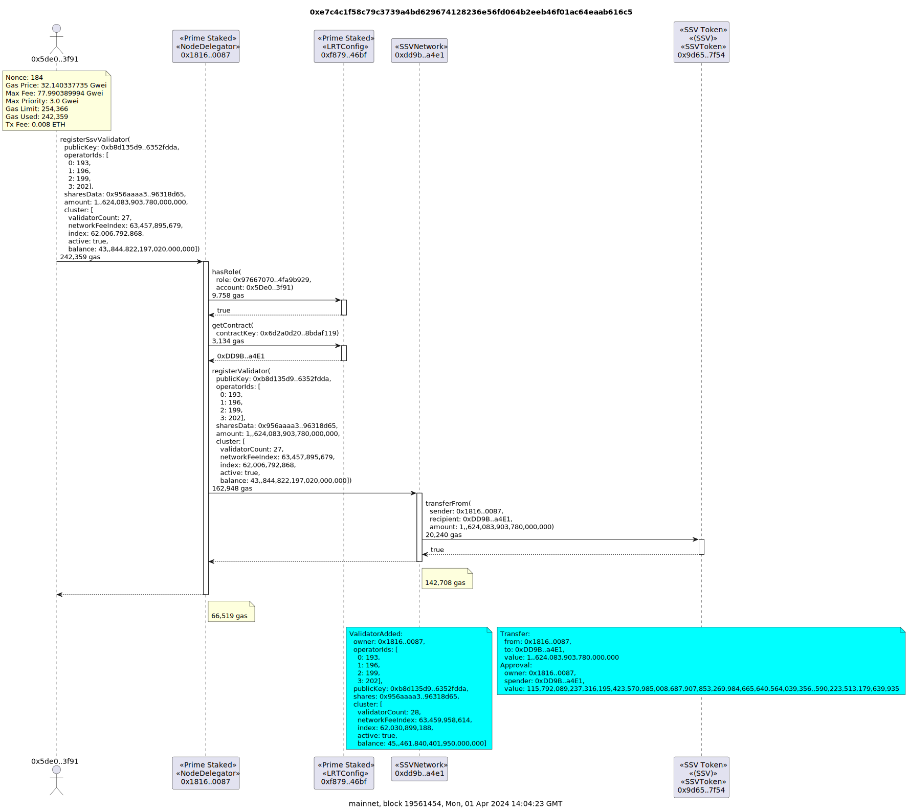
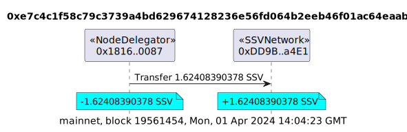
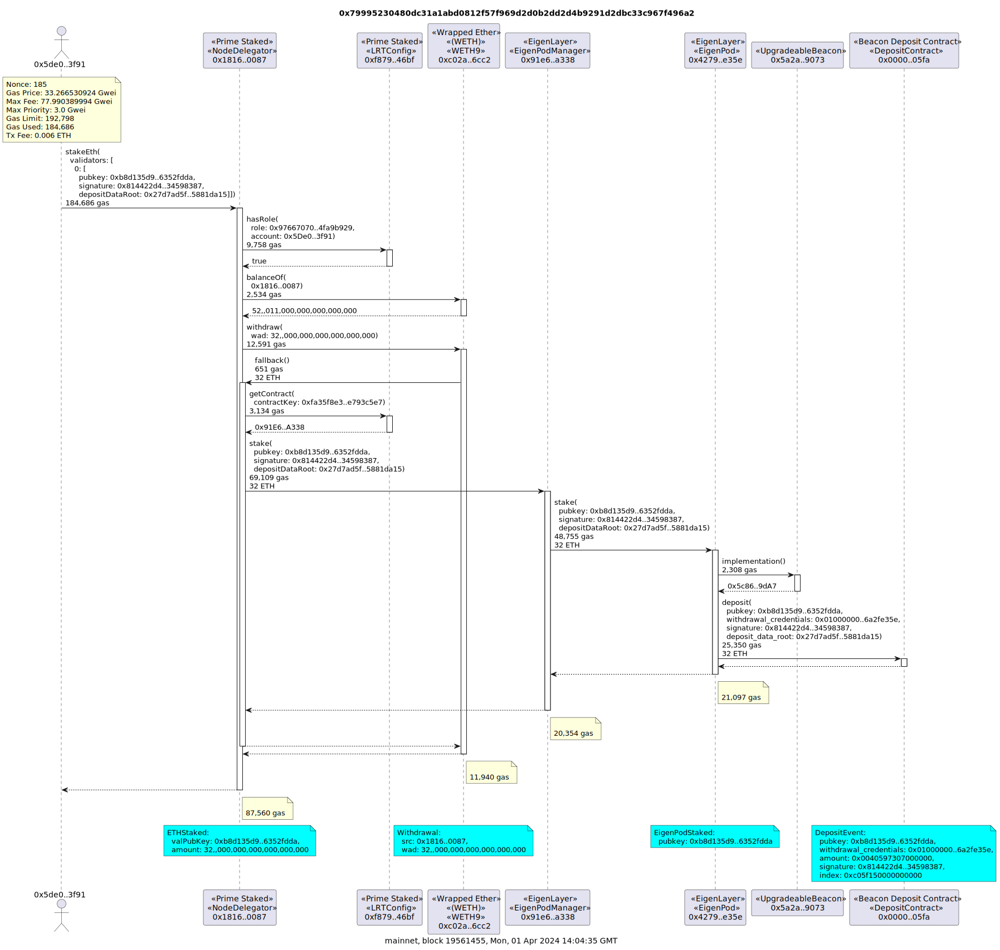
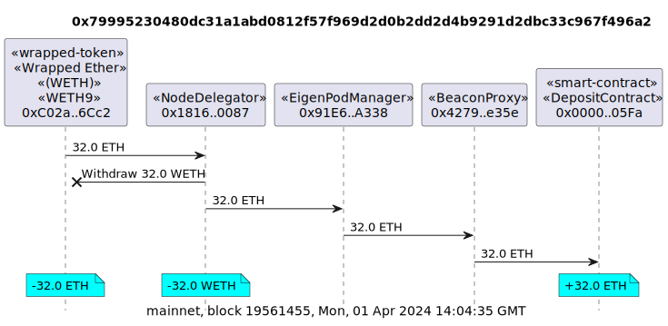

# Example Transactions

## mETH depositAsset

tx
[0x8caeaf8007e168307367d2be9fbaa8f8dd7defd5f413c596381359336482c032](https://etherscan.io/tx/0x8caeaf8007e168307367d2be9fbaa8f8dd7defd5f413c596381359336482c032)

`tx2uml 0x8caeaf8007e168307367d2be9fbaa8f8dd7defd5f413c596381359336482c032 -v -cf ./prime.config.json -x -d 3`

`tx2uml value 0x8caeaf8007e168307367d2be9fbaa8f8dd7defd5f413c596381359336482c032 -v -cf ./prime.config.json -hf`

## stETH depositAsset

tx
[0xa8789fd3d90d9174322c1d9426e8a6415df6a40ba70bfc11984f2c8c09232a28](https://etherscan.io/tx/0xa8789fd3d90d9174322c1d9426e8a6415df6a40ba70bfc11984f2c8c09232a28)

`tx2uml 0xa8789fd3d90d9174322c1d9426e8a6415df6a40ba70bfc11984f2c8c09232a28 -v -cf ./prime.config.json -x -d 3`

## updatePrimeETHPrice

tx
[0xd0105a9aa24acf8e1708177277a976d76d23144dde7aa3fa0c7ab78f7ba52bb7](https://etherscan.io/tx/0xd0105a9aa24acf8e1708177277a976d76d23144dde7aa3fa0c7ab78f7ba52bb7)

`tx2uml 0xd0105a9aa24acf8e1708177277a976d76d23144dde7aa3fa0c7ab78f7ba52bb7 -v -cf ./prime.config.json -x -d 3`

## transferAssetToNodeDelegator

tx
[0xcd80037a9de62266685baf6fd2628f7ceb56c2afc212f57d7fc8f605e6b901d1](https://etherscan.io/tx/0xcd80037a9de62266685baf6fd2628f7ceb56c2afc212f57d7fc8f605e6b901d1)

`tx2uml 0xcd80037a9de62266685baf6fd2628f7ceb56c2afc212f57d7fc8f605e6b901d1 -v -cf ./prime.config.json -x -d 3`

`tx2uml value 0xcd80037a9de62266685baf6fd2628f7ceb56c2afc212f57d7fc8f605e6b901d1 -v -cf ./prime.config.json -hf`

## Transfer of multiple assets to EigenLayer

tx 1
[0x7d1e4958d23c06af4169652077189425124da327c26d183f189cbd65723d3181](https://etherscan.io/tx/0x7d1e4958d23c06af4169652077189425124da327c26d183f189cbd65723d3181)

tx 2
[0x741d167a0d5065efce9a61621d61ee71b7d8b8e748f81f803d90490ebc4f7f6b](https://etherscan.io/tx/0x741d167a0d5065efce9a61621d61ee71b7d8b8e748f81f803d90490ebc4f7f6b)

`tx2uml 0x7d1e4958d23c06af4169652077189425124da327c26d183f189cbd65723d3181 -v -cf ./prime.config.json -x -d 3`

`tx2uml 0x741d167a0d5065efce9a61621d61ee71b7d8b8e748f81f803d90490ebc4f7f6b -v -cf ./prime.config.json -x -d 3`

`tx2uml value 0x7d1e4958d23c06af4169652077189425124da327c26d183f189cbd65723d3181,0x741d167a0d5065efce9a61621d61ee71b7d8b8e748f81f803d90490ebc4f7f6b -v -cf ./prime.config.json -hf`

## Deposit OETH into EigenLayer Strategy

tx
[0xbb9c26b621ce45ae734188fbd37d659a5b4cf8449a627e1c25646d95db471197](https://etherscan.io/tx/0xbb9c26b621ce45ae734188fbd37d659a5b4cf8449a627e1c25646d95db471197)

`tx2uml 0xbb9c26b621ce45ae734188fbd37d659a5b4cf8449a627e1c25646d95db471197 -v -cf ./prime.config.json -x -d 3`

`tx2uml value 0xbb9c26b621ce45ae734188fbd37d659a5b4cf8449a627e1c25646d95db471197 -v -cf ./prime.config.json -hf`

## Register validator

tx
[0xe7c4c1f58c79c3739a4bd629674128236e56fd064b2eeb46f01ac64eaab616c5](https://etherscan.io/tx/0xe7c4c1f58c79c3739a4bd629674128236e56fd064b2eeb46f01ac64eaab616c5)

`tx2uml 0xe7c4c1f58c79c3739a4bd629674128236e56fd064b2eeb46f01ac64eaab616c5 -v -x -cf ./prime.config.json`

`tx2uml value 0xe7c4c1f58c79c3739a4bd629674128236e56fd064b2eeb46f01ac64eaab616c5 -v -cf ./prime.config.json -hf`

## Stake ETH in validator

tx
[0x79995230480dc31a1abd0812f57f969d2d0b2dd2d4b9291d2dbc33c967f496a2](https://etherscan.io/tx/0x79995230480dc31a1abd0812f57f969d2d0b2dd2d4b9291d2dbc33c967f496a2)

`tx2uml 0x79995230480dc31a1abd0812f57f969d2d0b2dd2d4b9291d2dbc33c967f496a2 -v -x --noAddresses 0x0000000000000000000000000000000000000002 -cf ./prime.config.json`

`tx2uml value 0x79995230480dc31a1abd0812f57f969d2d0b2dd2d4b9291d2dbc33c967f496a2 -v -cf ./prime.config.json -hf`

