# Example Transactions

## mETH depositAsset

tx
[0x8caeaf8007e168307367d2be9fbaa8f8dd7defd5f413c596381359336482c032](https://etherscan.io/tx/0x8caeaf8007e168307367d2be9fbaa8f8dd7defd5f413c596381359336482c032)

`tx2uml 0x8caeaf8007e168307367d2be9fbaa8f8dd7defd5f413c596381359336482c032 -v -cf ./prime.config.json -x -d 3`

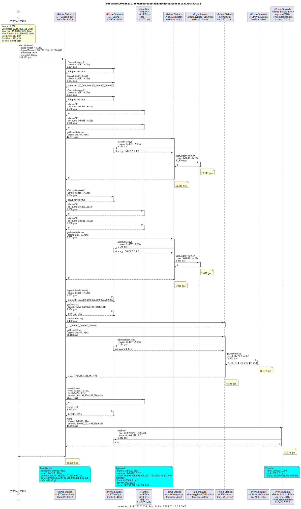

`tx2uml value 0x8caeaf8007e168307367d2be9fbaa8f8dd7defd5f413c596381359336482c032 -v -cf ./prime.config.json -hf`

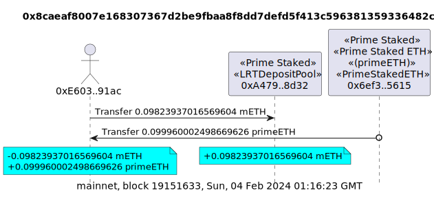

## stETH depositAsset

tx
[0xa8789fd3d90d9174322c1d9426e8a6415df6a40ba70bfc11984f2c8c09232a28](https://etherscan.io/tx/0xa8789fd3d90d9174322c1d9426e8a6415df6a40ba70bfc11984f2c8c09232a28)

`tx2uml 0xa8789fd3d90d9174322c1d9426e8a6415df6a40ba70bfc11984f2c8c09232a28 -v -cf ./prime.config.json -x -d 3`

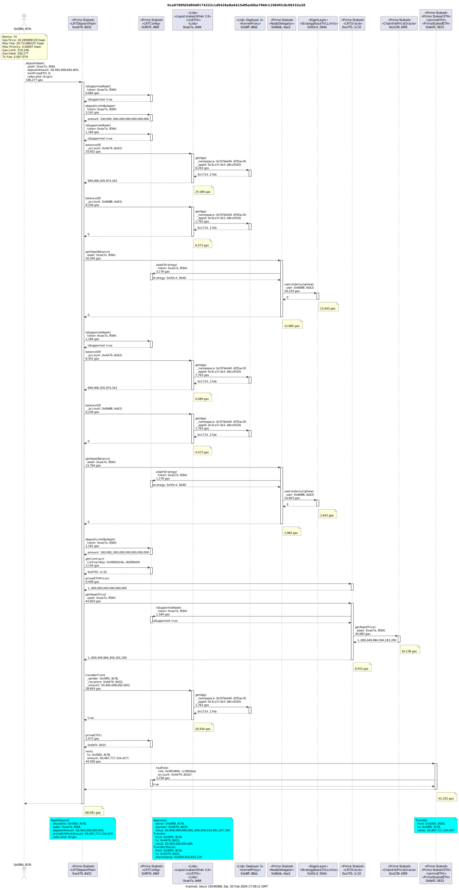

## updatePrimeETHPrice

tx
[0xd0105a9aa24acf8e1708177277a976d76d23144dde7aa3fa0c7ab78f7ba52bb7](https://etherscan.io/tx/0xd0105a9aa24acf8e1708177277a976d76d23144dde7aa3fa0c7ab78f7ba52bb7)

`tx2uml 0xd0105a9aa24acf8e1708177277a976d76d23144dde7aa3fa0c7ab78f7ba52bb7 -v -cf ./prime.config.json -x -d 3`

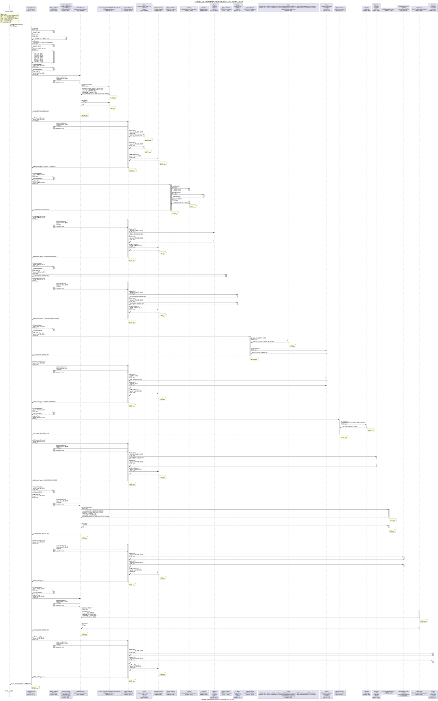

## transferAssetToNodeDelegator

tx
[0xcd80037a9de62266685baf6fd2628f7ceb56c2afc212f57d7fc8f605e6b901d1](https://etherscan.io/tx/0xcd80037a9de62266685baf6fd2628f7ceb56c2afc212f57d7fc8f605e6b901d1)

`tx2uml 0xcd80037a9de62266685baf6fd2628f7ceb56c2afc212f57d7fc8f605e6b901d1 -v -cf ./prime.config.json -x -d 3`

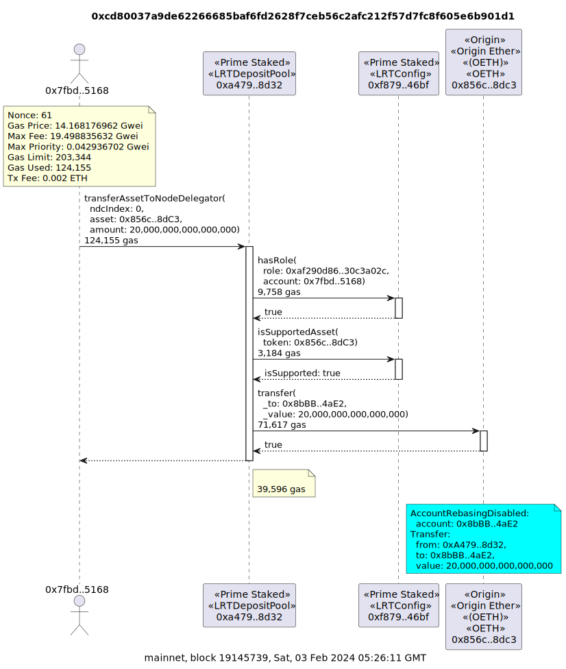

`tx2uml value 0xcd80037a9de62266685baf6fd2628f7ceb56c2afc212f57d7fc8f605e6b901d1 -v -cf ./prime.config.json -hf`

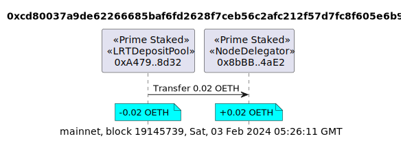

## Transfer of multiple assets to EigenLayer

tx 1
[0x7d1e4958d23c06af4169652077189425124da327c26d183f189cbd65723d3181](https://etherscan.io/tx/0x7d1e4958d23c06af4169652077189425124da327c26d183f189cbd65723d3181)

tx 2
[0x741d167a0d5065efce9a61621d61ee71b7d8b8e748f81f803d90490ebc4f7f6b](https://etherscan.io/tx/0x741d167a0d5065efce9a61621d61ee71b7d8b8e748f81f803d90490ebc4f7f6b)

`tx2uml 0x7d1e4958d23c06af4169652077189425124da327c26d183f189cbd65723d3181 -v -cf ./prime.config.json -x -d 3`

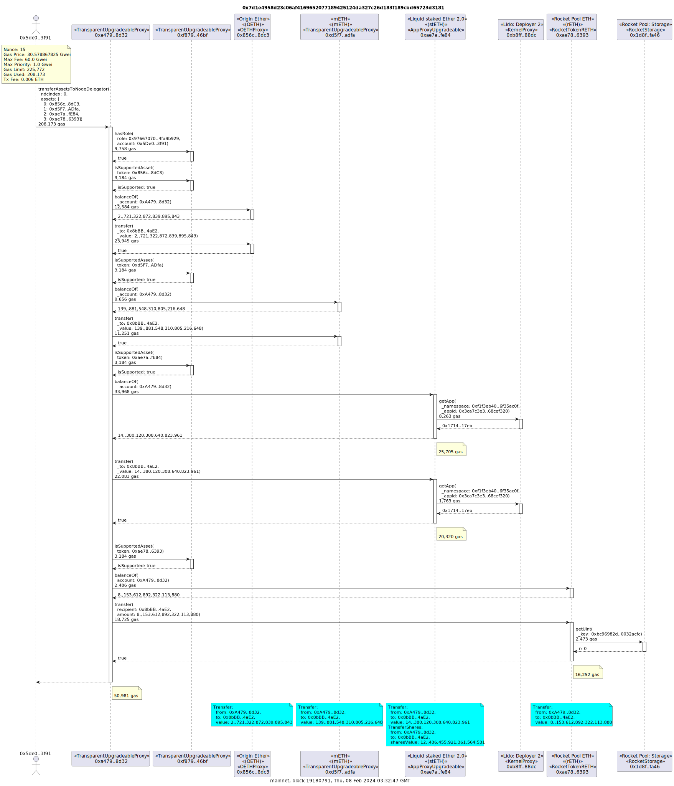

`tx2uml 0x741d167a0d5065efce9a61621d61ee71b7d8b8e748f81f803d90490ebc4f7f6b -v -cf ./prime.config.json -x -d 3`

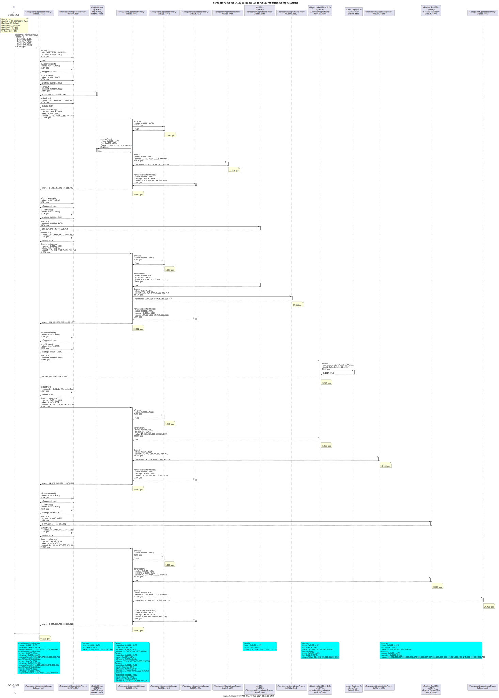

`tx2uml value 0x7d1e4958d23c06af4169652077189425124da327c26d183f189cbd65723d3181,0x741d167a0d5065efce9a61621d61ee71b7d8b8e748f81f803d90490ebc4f7f6b -v -cf ./prime.config.json -hf`

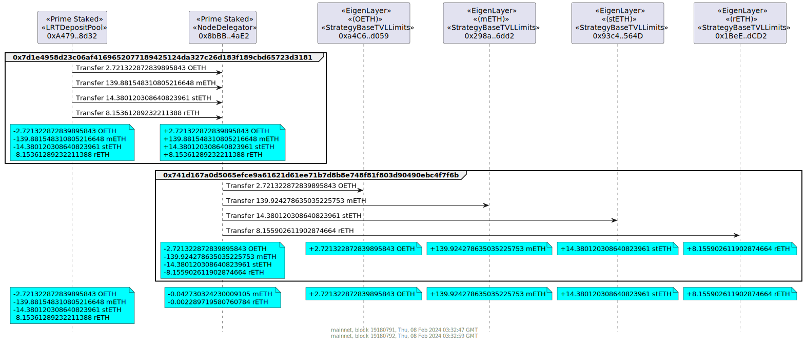

## Deposit OETH into EigenLayer Strategy

tx
[0xbb9c26b621ce45ae734188fbd37d659a5b4cf8449a627e1c25646d95db471197](https://etherscan.io/tx/0xbb9c26b621ce45ae734188fbd37d659a5b4cf8449a627e1c25646d95db471197)

`tx2uml 0xbb9c26b621ce45ae734188fbd37d659a5b4cf8449a627e1c25646d95db471197 -v -cf ./prime.config.json -x -d 3`

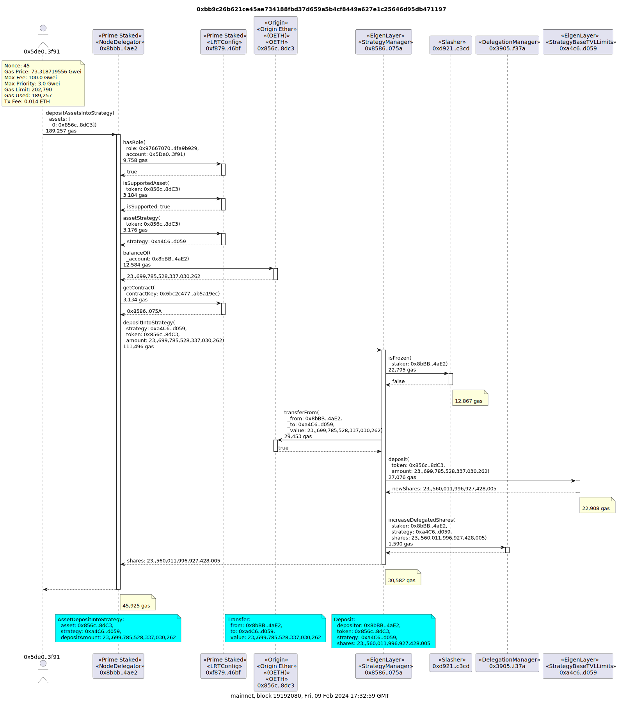

`tx2uml value 0xbb9c26b621ce45ae734188fbd37d659a5b4cf8449a627e1c25646d95db471197 -v -cf ./prime.config.json -hf`

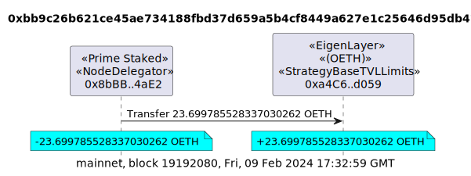

## Staker requests withdrawal of stETH

tx
[0x515e226d7ecb9f0c6705e297f0a5bf9abc3d71840a344fc2c580fe6407a2e46a](https://holesky.etherscan.io/tx/0x515e226d7ecb9f0c6705e297f0a5bf9abc3d71840a344fc2c580fe6407a2e46a)
on Holesky.

`tx2uml 0x515e226d7ecb9f0c6705e297f0a5bf9abc3d71840a344fc2c580fe6407a2e46a -x -v -c holesky -e https://api-holesky.etherscan.io/api -k ${HOLESKY_ETHERSCAN_API_KEY} -u ${ARCHIVE_NODE_URL}`

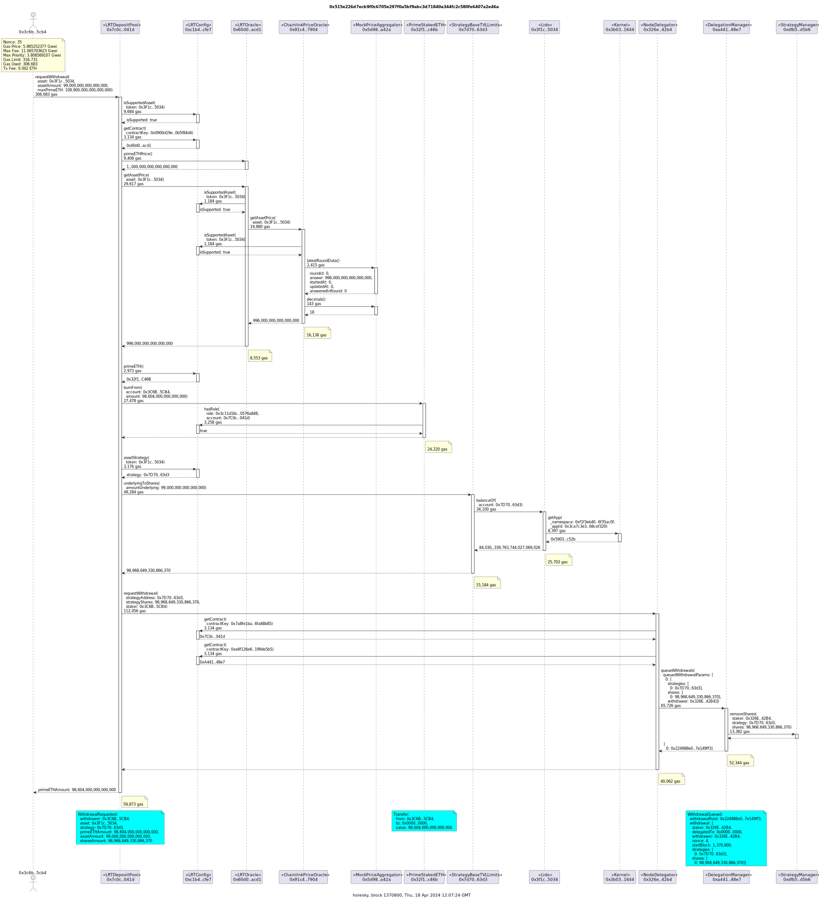

## Staker claims withdrawal of stETH

tx
[0xc6aa0bc886d60b79613885c1f7e26fe5e7833a949d2f9568dbbff2a91c756383](https://holesky.etherscan.io/tx/0xc6aa0bc886d60b79613885c1f7e26fe5e7833a949d2f9568dbbff2a91c756383)
on Holesky.

`tx2uml 0xc6aa0bc886d60b79613885c1f7e26fe5e7833a949d2f9568dbbff2a91c756383 -x -v -c holesky -e https://api-holesky.etherscan.io/api -k ${HOLESKY_ETHERSCAN_API_KEY} -u ${ARCHIVE_NODE_URL}`

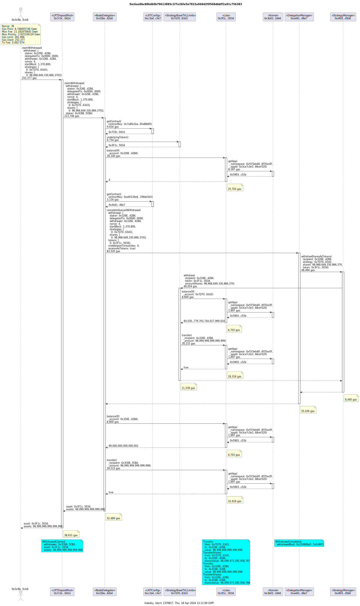

## Prime Operator requests internal withdrawal of stETH

tx
[0x318133d4bd263a58598bdd6fb9e09ac7e58c263a0bb23d2fedf6a7e17f09d583](https://holesky.etherscan.io/tx/0x318133d4bd263a58598bdd6fb9e09ac7e58c263a0bb23d2fedf6a7e17f09d583)
on Holesky.

`tx2uml 0x318133d4bd263a58598bdd6fb9e09ac7e58c263a0bb23d2fedf6a7e17f09d583 -x -v -c holesky -e https://api-holesky.etherscan.io/api -k ${HOLESKY_ETHERSCAN_API_KEY} -u ${ARCHIVE_NODE_URL}`

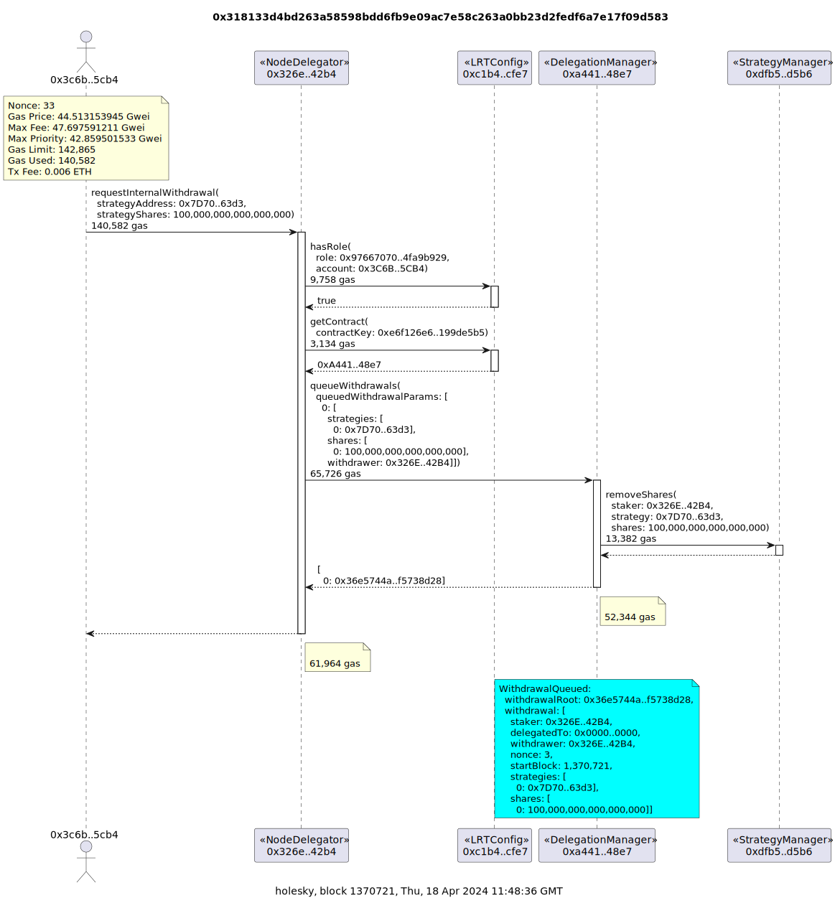

## Prime Operator claims internal withdrawal of stETH

tx
[0x67e302c97bdc73e40bbf6fca3d85affa25a11b9fc201945cdfcd291951c21552](https://holesky.etherscan.io/tx/0x67e302c97bdc73e40bbf6fca3d85affa25a11b9fc201945cdfcd291951c21552)
on Holesky.

`tx2uml 0x67e302c97bdc73e40bbf6fca3d85affa25a11b9fc201945cdfcd291951c21552 -x -v -c holesky -e https://api-holesky.etherscan.io/api -k ${HOLESKY_ETHERSCAN_API_KEY} -u ${ARCHIVE_NODE_URL}`

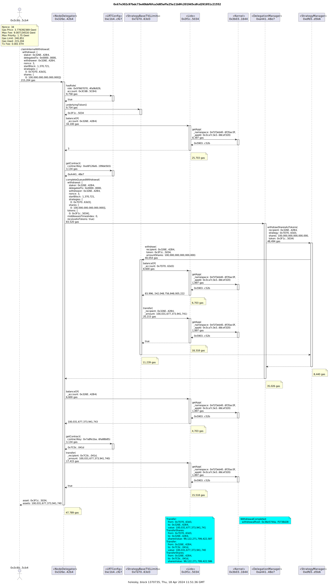

## Prime Manager delegates to P2P EigenLayer Operator for LST Node Delegator

tx
[0x29b4158349ae1315fb9c0d57f688d3b094b989c35d89b10f0f915e008c62a007](https://holesky.etherscan.io/tx/0x29b4158349ae1315fb9c0d57f688d3b094b989c35d89b10f0f915e008c62a007)
on Holesky.

`tx2uml 0x29b4158349ae1315fb9c0d57f688d3b094b989c35d89b10f0f915e008c62a007 -x -v -c holesky -e https://api-holesky.etherscan.io/api -k ${HOLESKY_ETHERSCAN_API_KEY} -u ${ARCHIVE_NODE_URL}`

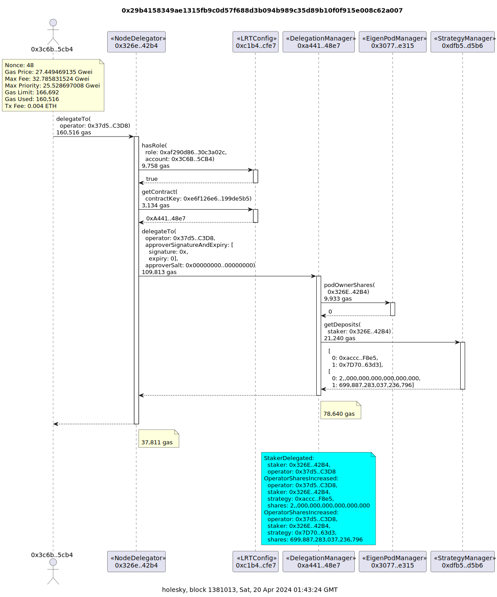

## Prime Manager undelegates from P2P EigenLayer Operator for LST Node Delegator

tx
[0x2d45c7bf6e4a73803b77146007aee777d1e667dac8bd933d3920a51bdc3e0329](https://holesky.etherscan.io/tx/0x2d45c7bf6e4a73803b77146007aee777d1e667dac8bd933d3920a51bdc3e0329)
on Holesky.

`tx2uml 0x2d45c7bf6e4a73803b77146007aee777d1e667dac8bd933d3920a51bdc3e0329 -x -v -c holesky -e https://api-holesky.etherscan.io/api -k ${HOLESKY_ETHERSCAN_API_KEY} -u ${ARCHIVE_NODE_URL}`

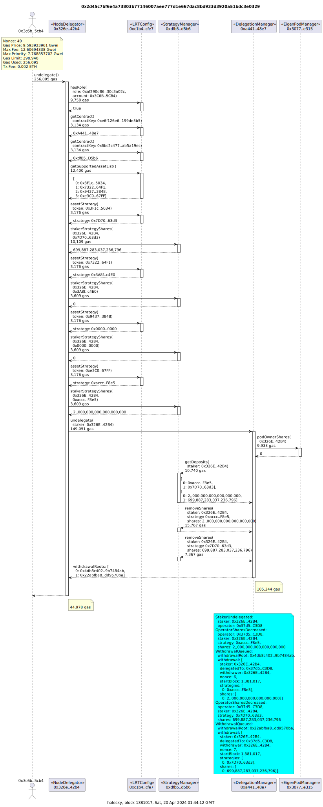
